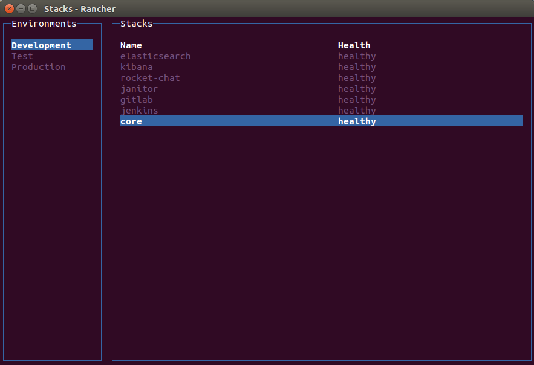
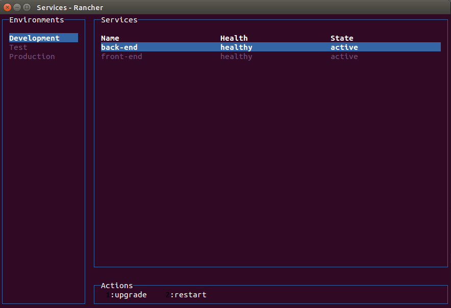

# Rancher Terminal UI

Manage your containers using a friendly terminal interface


[](https://standardjs.com)

## Usage
```
$ sudo apt-get install -y nodejs
$ npm i -g
$ export RANCHER_URL=http://<server_ip>:8080
$ export RANCHER_ACCESS_KEY=<accessKey_of_account_api_key>
$ export RANCHER_SECRET_KEY=<secretKey_of_account_api_key>
$ rancher
```

## ENV

RANCHER_URL=http://<server_ip>:8080

RANCHER_ACCESS_KEY=<accessKey_of_account_api_key>

RANCHER_SECRET_KEY=<secretKey_of_account_api_key>

## Demo


